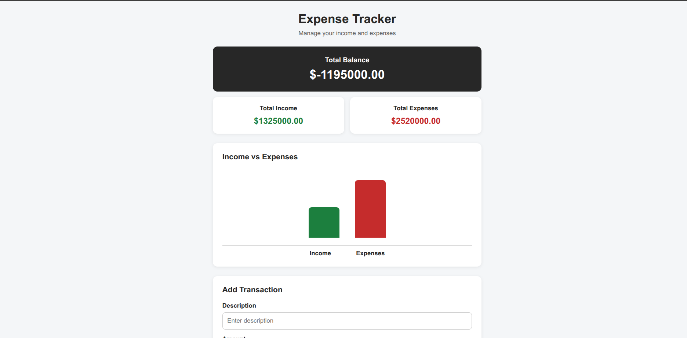
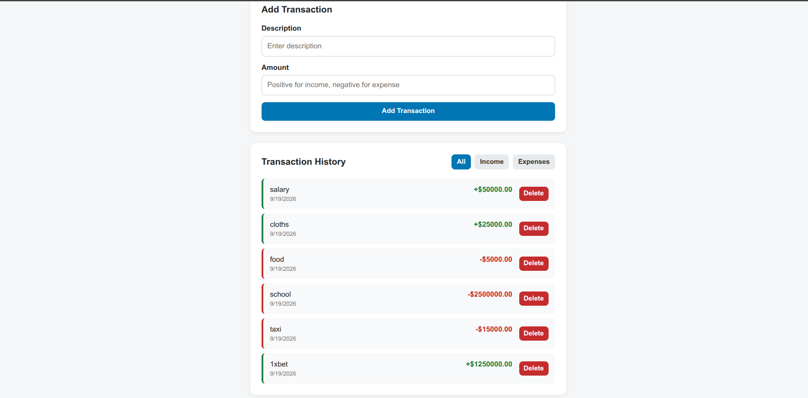

# 💰 Expense Tracker

> A responsive web-based personal expense tracker built with HTML, CSS, and JavaScript that allows users to manage their income and expenses, view transaction history, track their balance, and monitor their finances through a simple and interactive interface.

---

## 📌 Problem Statement

Keeping track of personal income and expenses can become difficult when transactions are recorded manually or across different places.

This project provides a simple way to record and manage financial transactions in one place. Users can add income and expenses, view their transaction history, delete transactions, filter transactions, and see their total balance.

The application also uses browser local storage so that transaction data remains available after refreshing the page.

---

## 🎯 Project Goals

* Build a responsive personal expense tracker
* Practice HTML structure and semantic markup
* Improve CSS styling and responsive layouts
* Strengthen JavaScript fundamentals
* Practice DOM manipulation
* Practice event handling
* Work with arrays and array methods in JavaScript
* Use `localStorage` to persist application data
* Calculate income, expenses, and total balance dynamically
* Create a simple interactive chart using HTML, CSS, and JavaScript
* Build a clean and user-friendly interface

---

## 🛠 Tech Stack

**Frontend:**

* HTML5
* CSS3
* JavaScript (ES6)

**Storage:**

* Browser `localStorage`

**Other Tools:**

* Git & GitHub
* VS Code

---

## 🖥 Features

* Add income transactions
* Add expense transactions
* Add a transaction description
* Enter positive amounts for income
* Enter negative amounts for expenses
* Display total balance
* Display total income
* Display total expenses
* Display transaction history
* Display the transaction date
* Delete transactions
* Filter transactions by:
  * All
  * Income
  * Expenses
* Display income in green
* Display expenses in red
* Dynamic income vs expenses chart
* Save transactions using `localStorage`
* Restore transactions after refreshing the page
* Responsive and mobile-friendly design
* Clean and simple user interface

---

## 📸 Screenshot



---

## ⚙ Install# 💰 Personal Expense Tracker

> A responsive web-based personal expense tracker built with HTML, CSS, and JavaScript that allows users to manage their income and expenses, view transaction history, track their balance, and monitor their finances through a simple and interactive interface.

---

## 📌 Problem Statement

Keeping track of personal income and expenses can become difficult when transactions are recorded manually or across different places.

This project provides a simple way to record and manage financial transactions in one place. Users can add income and expenses, view their transaction history, delete transactions, filter transactions, and see their total balance.

The application also uses browser local storage so that transaction data remains available after refreshing the page.

---

## 🎯 Project Goals

* Build a responsive personal expense tracker
* Practice HTML structure and semantic markup
* Improve CSS styling and responsive layouts
* Strengthen JavaScript fundamentals
* Practice DOM manipulation
* Practice event handling
* Work with arrays and array methods in JavaScript
* Use `localStorage` to persist application data
* Calculate income, expenses, and total balance dynamically
* Create a simple interactive chart using HTML, CSS, and JavaScript
* Build a clean and user-friendly interface

---

## 🛠 Tech Stack

**Frontend:**

* HTML5
* CSS3
* JavaScript (ES6)

**Storage:**

* Browser `localStorage`

**Other Tools:**

* Git & GitHub
* VS Code

---

## 🖥 Features

* Add income transactions
* Add expense transactions
* Add a transaction description
* Enter positive amounts for income
* Enter negative amounts for expenses
* Display total balance
* Display total income
* Display total expenses
* Display transaction history
* Display the transaction date
* Delete transactions
* Filter transactions by:
  * All
  * Income
  * Expenses
* Display income in green
* Display expenses in red
* Dynamic income vs expenses chart
* Save transactions using `localStorage`
* Restore transactions after refreshing the page
* Responsive and mobile-friendly design
* Clean and simple user interface

---

## 📸 Screenshot



---

## ⚙ Installation & Setup

### 📥 Clone the repository

```bash
git clone git@github.com:Hache-premier/expense-tracker.git
cd expense-trackeration & Setup

### 📥 Clone the repository

```bash
git clone git@github.com:Hache-premier/expense-tracker.git
cd expense-tracker